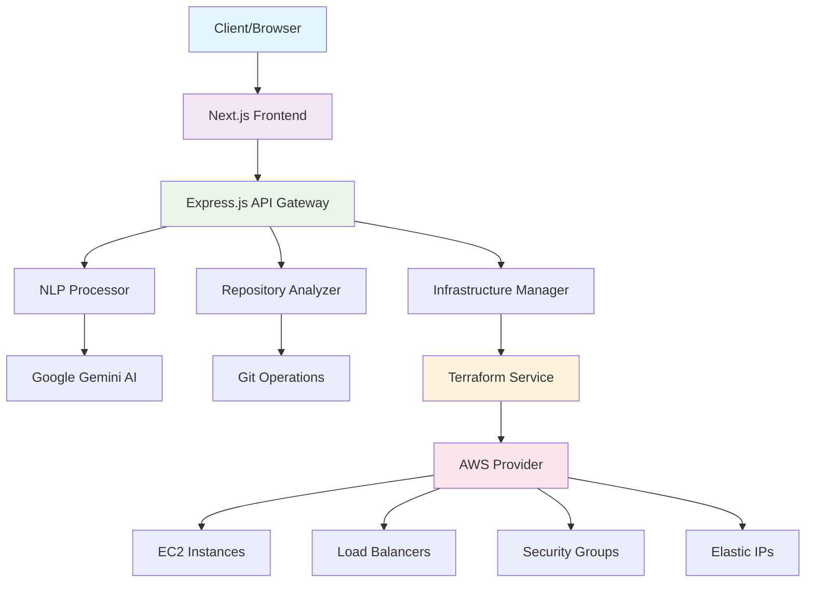

# Arvo Auto-Deployment System

[](https://opensource.org/licenses/MIT)
[](https://nodejs.org/)
[](https://www.terraform.io/)

A comprehensive backend API system that automates the process of deploying applications based on natural language input and code repositories. The system intelligently analyzes repositories, determines infrastructure requirements, and deploys applications with minimal user intervention.

## � Table of Contents

- [�📊 Project Statistics](#-project-statistics)
- [🚀 Core Features](#-core-features)
- [🛠 System Requirements](#️-system-requirements)
- [📦 Installation & Setup](#-installation--setup)
- [🎯 API Endpoints](#-api-endpoints)
- [🔧 Supported Application Types](#-supported-application-types)
- [📝 Usage Examples](#-usage-examples)
- [🏗 System Architecture](#-system-architecture)
- [🔒 Security Features](#-security-features)
- [📊 Monitoring & Logging](#-monitoring--logging)
- [🔄 Development](#-development)
- [🌟 Key Features Implemented](#-key-features-implemented)
- [🚨 Important Notes](#-important-notes)
- [📚 Dependencies & Sources](#-dependencies--sources)
- [🤝 Contributing](#-contributing)
- [🆘 Support & Troubleshooting](#️-support--troubleshooting)
- [📄 License](#-license)

## 🚀 Core Features

- **🧠 Natural Language Processing**: Parse deployment requirements from plain English descriptions using Google Gemini AI
- **🔍 Repository Analysis**: Automatically analyze code repositories to identify application type, dependencies, and configuration
- **🏗️ Infrastructure Automation**: Determine optimal deployment strategy (VM, container, serverless, static, Kubernetes)
- **🌍 Terraform Integration**: Provision infrastructure using Infrastructure as Code with automatic state management
- **☁️ Multi-Cloud Support**: AWS (fully implemented), Azure and GCP (planned)
- **💬 Chat Interface**: Intuitive conversational deployment experience with Next.js frontend
- **📊 Real-time Monitoring**: Comprehensive logging, deployment status tracking, and step-by-step progress visualization
- **🔐 Security**: Built-in security groups, IAM roles, and industry best practices

## 🛠 System Requirements

### Prerequisites

- **Node.js**: Version 16.0.0 or higher
- **Terraform**: Version 1.0.0 or higher
- **AWS CLI**: Configured with appropriate credentials
- **Git**: For repository operations
- **Python**: Version 3.8+ (for deployment targets)

### Supported Operating Systems

- macOS (Intel & Apple Silicon)
- Linux (Ubuntu 18.04+, CentOS 7+, Amazon Linux 2)
- Windows 10/11 with WSL2

### Environment Variables

Copy `.env.example` to `.env` and configure:

```bash
# Required
GEMINI_API_KEY=your_gemini_api_key_here
AWS_ACCESS_KEY_ID=your_aws_access_key
AWS_SECRET_ACCESS_KEY=your_aws_secret_key

# Optional
AWS_REGION=us-east-1
TERRAFORM_PATH=/usr/local/bin/terraform
GITHUB_TOKEN=your_github_token_here
```

## 📦 Installation & Setup

### Quick Start

```bash
# Clone the repository
git clone https://github.com/Arvo-AI/arvo-deployment-system.git
cd arvo-deployment-system

# Install backend dependencies
npm install

# Install frontend dependencies
cd frontend && npm install && cd ..

# Copy and configure environment
cp .env.example .env
# Edit .env with your API keys and credentials

# Start backend server
npm start

# In a new terminal, start frontend
cd frontend && npm run dev
```

### Environment Configuration

Create a `.env` file in the root directory:

```bash
# Required API Keys
GEMINI_API_KEY=your_gemini_api_key_here
AWS_ACCESS_KEY_ID=your_aws_access_key
AWS_SECRET_ACCESS_KEY=your_aws_secret_key

# Optional Configuration
AWS_REGION=us-east-1
PORT=3001
TERRAFORM_PATH=/usr/local/bin/terraform
GITHUB_TOKEN=your_github_token_here

# Logging Configuration
LOG_LEVEL=info
LOG_TO_FILE=true
LOG_DIRECTORY=./logs
```

### AWS Credentials Setup

1. **AWS CLI Method** (Recommended):

   ```bash
   aws configure
   ```
2. **Environment Variables**:
   Set `AWS_ACCESS_KEY_ID` and `AWS_SECRET_ACCESS_KEY` in `.env`
3. **IAM Role** (EC2 deployment):
   Attach appropriate IAM role to EC2 instance

## 🎯 API Endpoints

### Health Check

```
GET /api/health
GET /api/health/status
```

### Deployment Endpoints

#### Chat Deployment (Recommended)

```
POST /api/deployment/chat
Content-Type: multipart/form-data

{
  "message": "Deploy this Flask application on AWS",
  "repositoryUrl": "https://github.com/Arvo-AI/hello_world",
  "codebase": [file] // Optional: Upload zip file instead
}
```

#### Analyze Repository

```
POST /api/deployment/analyze
{
  "description": "Deploy this Flask application on AWS",
  "repositoryUrl": "https://github.com/Arvo-AI/hello_world"
}
```

#### Deploy Application

```
POST /api/deployment/deploy
{
  "description": "Deploy this Flask application on AWS",
  "repositoryUrl": "https://github.com/Arvo-AI/hello_world",
  "analysisId": "optional-previous-analysis-id"
}
```

#### Check Deployment Status

```
GET /api/deployment/:deploymentId/status
```

#### Get Deployment Logs

```
GET /api/deployment/:deploymentId/logs
```

#### Destroy Deployment

```
DELETE /api/deployment/:deploymentId
```

## 🔧 Supported Application Types

### Languages & Frameworks

- **Node.js**: Express.js, Next.js, React, Vue.js, Angular
- **Python**: Flask, Django, FastAPI, Streamlit
- **Java**: Spring Boot, Maven projects
- **Go**: Native Go applications, Gin, Echo
- **PHP**: Laravel, Symfony, native PHP
- **Ruby**: Ruby on Rails, Sinatra
- **Static Sites**: HTML/CSS/JavaScript, Jekyll, Hugo

### Deployment Strategies

| Strategy             | Use Case                     | AWS Services           |
| -------------------- | ---------------------------- | ---------------------- |
| **Static**     | Frontend apps, documentation | S3 + CloudFront        |
| **Serverless** | APIs, microservices          | Lambda + API Gateway   |
| **Container**  | Scalable applications        | ECS Fargate + ALB      |
| **VM**         | Traditional applications     | EC2 + ALB + Elastic IP |
| **Kubernetes** | Complex microservices        | EKS + ALB              |

## 📝 Usage Examples

### 1. Deploy Flask Application

```bash
curl -X POST http://localhost:3000/api/deployment/chat \
  -F "message=Deploy this Flask application on AWS with a database" \
  -F "repositoryUrl=https://github.com/Arvo-AI/hello_world"
```

### 2. Deploy Next.js App with Static Hosting

```bash
curl -X POST http://localhost:3000/api/deployment/chat \
  -F "message=Deploy this Next.js app as a static site on AWS" \
  -F "repositoryUrl=https://github.com/username/nextjs-app"
```

### 3. Deploy with Uploaded Zip

```bash
curl -X POST http://localhost:3000/api/deployment/chat \
  -F "message=Deploy this Django application on AWS" \
  -F "codebase=@/path/to/app.zip"
```

## 🏗 System Architecture



### Component Architecture

```
┌─────────────────┐    ┌─────────────────┐    ┌─────────────────┐
│   Frontend      │────│  API Gateway    │────│ NLP Processor   │
│   (Next.js)     │    │  (Express.js)   │    │ (Gemini AI)     │
└─────────────────┘    └─────────────────┘    └─────────────────┘
         │                       │                       │
         ▼                       ▼                       ▼
┌─────────────────┐    ┌─────────────────┐    ┌─────────────────┐
│ Repository      │────│ Infrastructure  │────│ Terraform       │
│ Analyzer        │    │ Manager         │    │ Service         │
└─────────────────┘    └─────────────────┘    └─────────────────┘
         │                       │                       │
         ▼                       ▼                       ▼
┌─────────────────┐    ┌─────────────────┐    ┌─────────────────┐
│ Git Operations  │────│ Strategy        │────│ AWS Provider    │
│ (simple-git)    │    │ Selection       │    │ (EC2/ELB/VPC)   │
└─────────────────┘    └─────────────────┘    └─────────────────┘
```

### Key Components

1. **DeploymentService**: Orchestrates the entire deployment process
2. **RepositoryAnalyzer**: Analyzes code repositories and determines application characteristics
3. **NLPProcessor**: Processes natural language requirements using Google Gemini or rule-based fallback
4. **InfrastructureManager**: Determines optimal deployment strategy and generates configurations
5. **TerraformService**: Handles infrastructure provisioning using Terraform

## 🔒 Security Features

- Input validation and sanitization
- Secure file uploads with type checking
- Path traversal protection
- Infrastructure security groups
- IAM roles with least privilege
- Secrets management integration
- HTTPS enforcement
- Rate limiting (configurable)

## 📊 Monitoring & Logging

- Structured JSON logging
- Deployment-specific log files
- Real-time deployment status tracking
- Terraform output capture
- Error tracking and reporting
- Performance metrics

## 🔄 Development

### Project Structure

```
src/
├── index.js              # Application entry point
├── routes/               # API routes
│   ├── deployment.js     # Deployment endpoints
│   └── health.js         # Health check endpoints
├── services/             # Business logic
│   ├── deploymentService.js
│   ├── repositoryAnalyzer.js
│   ├── nlpProcessor.js
│   ├── infrastructureManager.js
│   └── terraformService.js
└── utils/                # Utilities
    ├── logger.js         # Logging configuration
    └── fileSystem.js     # File system utilities
```

### Running Tests

```bash
npm test
```

### Development Mode

```bash
npm run dev
```

## 🌟 Key Features Implemented

### ✅ Natural Language Processing

- Google Gemini integration for advanced NLP
- Rule-based fallback for environments without Gemini API access
- Intent recognition for deployment requirements
- Parameter extraction (cloud provider, deployment type, etc.)

### ✅ Repository Analysis

- Multi-language application detection
- Dependency analysis (package.json, requirements.txt, etc.)
- Build and start command detection
- Database requirement identification
- Security configuration analysis

### ✅ Infrastructure Management

- Automatic deployment strategy selection
- Multi-cloud provider support (AWS focus)
- Infrastructure as Code with Terraform
- Security best practices implementation
- Cost optimization recommendations

### ✅ Deployment Automation

- Full deployment lifecycle management
- Real-time status tracking
- Comprehensive logging
- Error handling and rollback capabilities
- Post-deployment verification

## 🚨 Important Notes

### For Production Use

1. **Security**: Configure proper AWS credentials with minimal required permissions
2. **Terraform State**: Use remote state backend (S3 + DynamoDB)
3. **Database**: Replace in-memory deployment storage with persistent database
4. **Monitoring**: Integrate with CloudWatch, Datadog, or similar
5. **Rate Limiting**: Implement API rate limiting
6. **Authentication**: Add proper authentication/authorization

### Cost Considerations

- Monitor AWS usage and costs
- Implement automatic resource cleanup
- Set up billing alerts
- Use appropriate instance sizes

## 📚 Dependencies & Sources

#### Backend Dependencies

| Package                         | Version      | Purpose                         | License      | Source                                                 |
| ------------------------------- | ------------ | ------------------------------- | ------------ | ------------------------------------------------------ |
| **express**               | ^4.18.2      | Web framework for Node.js       | MIT          | [Express.js](https://expressjs.com/)                      |
| **@google/generative-ai** | ^0.2.1       | Google Gemini AI integration    | Apache-2.0   | [Google AI](https://ai.google.dev/)                       |
| **simple-git**            | ^3.19.1      | Git operations in Node.js       | MIT          | [Simple Git](https://github.com/steveukx/git-js)          |
| **adm-zip**               | ^0.5.10      | ZIP file compression/extraction | MIT          | [ADM-ZIP](https://github.com/cthackers/adm-zip)           |
| **winston**               | ^3.10.0      | Logging library                 | MIT          | [Winston](https://github.com/winstonjs/winston)           |
| **multer**                | ^1.4.5-lts.1 | File upload middleware          | MIT          | [Multer](https://github.com/expressjs/multer)             |
| **axios**                 | ^1.5.0       | HTTP client                     | MIT          | [Axios](https://axios-http.com/)                          |
| **natural**               | ^6.6.0       | Natural language processing     | MIT          | [Natural](https://github.com/NaturalNode/natural)         |
| **dotenv**                | ^16.3.1      | Environment variable loader     | BSD-2-Clause | [Dotenv](https://github.com/motdotla/dotenv)              |
| **cors**                  | ^2.8.5       | Cross-Origin Resource Sharing   | MIT          | [CORS](https://github.com/expressjs/cors)                 |
| **helmet**                | ^7.0.0       | Security middleware             | MIT          | [Helmet](https://helmetjs.github.io/)                     |
| **fs-extra**              | ^11.1.1      | Enhanced file system operations | MIT          | [FS-Extra](https://github.com/jprichardson/node-fs-extra) |
| **js-yaml**               | ^4.1.0       | YAML parser/serializer          | MIT          | [JS-YAML](https://github.com/nodeca/js-yaml)              |
| **node-cron**             | ^3.0.2       | Task scheduling                 | ISC          | [Node-Cron](https://github.com/node-cron/node-cron)       |
| **uuid**                  | ^9.0.0       | UUID generation                 | MIT          | [UUID](https://github.com/uuidjs/uuid)                    |

#### Frontend Dependencies

| Package                | Version  | Purpose                 | License    | Source                                               |
| ---------------------- | -------- | ----------------------- | ---------- | ---------------------------------------------------- |
| **next**         | ^14.0.3  | React framework         | MIT        | [Next.js](https://nextjs.org/)                          |
| **react**        | 18.2.0   | UI library              | MIT        | [React](https://reactjs.org/)                           |
| **react-dom**    | 18.2.0   | React DOM renderer      | MIT        | [React DOM](https://reactjs.org/)                       |
| **typescript**   | ^5.0.0   | TypeScript compiler     | Apache-2.0 | [TypeScript](https://www.typescriptlang.org/)           |
| **tailwindcss**  | ^3.3.0   | CSS framework           | MIT        | [Tailwind CSS](https://tailwindcss.com/)                |
| **lucide-react** | ^0.294.0 | Icon library            | ISC        | [Lucide React](https://lucide.dev/)                     |
| **autoprefixer** | ^10.4.16 | CSS prefix tool         | MIT        | [Autoprefixer](https://github.com/postcss/autoprefixer) |
| **postcss**      | ^8.4.31  | CSS transformation tool | MIT        | [PostCSS](https://postcss.org/)                         |

### Development Dependencies

| Package                      | Version | Purpose                | License | Source                                                       |
| ---------------------------- | ------- | ---------------------- | ------- | ------------------------------------------------------------ |
| **nodemon**            | ^3.0.1  | Development server     | MIT     | [Nodemon](https://nodemon.io/)                                  |
| **jest**               | ^29.6.4 | Testing framework      | MIT     | [Jest](https://jestjs.io/)                                      |
| **supertest**          | ^6.3.3  | HTTP assertion library | MIT     | [SuperTest](https://github.com/ladjs/supertest)                 |
| **eslint**             | ^8.0.0  | JavaScript linter      | MIT     | [ESLint](https://eslint.org/)                                   |
| **eslint-config-next** | 14.0.3  | Next.js ESLint config  | MIT     | [Next.js ESLint](https://nextjs.org/docs/basic-features/eslint) |

### External Tools & Services

#### Infrastructure & Cloud Services

| Tool/Service           | Version  | Purpose                    | License    | Documentation                                                       |
| ---------------------- | -------- | -------------------------- | ---------- | ------------------------------------------------------------------- |
| **Terraform**    | ≥1.0.0  | Infrastructure as Code     | MPL-2.0    | [Terraform](https://www.terraform.io/)                                 |
| **AWS CLI**      | ≥2.0.0  | AWS command line interface | Apache-2.0 | [AWS CLI](https://aws.amazon.com/cli/)                                 |
| **AWS Provider** | ~>5.31.0 | Terraform AWS provider     | MPL-2.0    | [AWS Provider](https://registry.terraform.io/providers/hashicorp/aws/) |

#### AI & Language Models

| Service                 | API Version | Purpose                     | Pricing     | Documentation                    |
| ----------------------- | ----------- | --------------------------- | ----------- | -------------------------------- |
| **Google Gemini** | v1          | Natural language processing | Pay-per-use | [Gemini AI](https://ai.google.dev/) |

### Technical References & Documentation

#### Core Technologies

1. **Node.js Documentation** - [https://nodejs.org/docs/](https://nodejs.org/docs/)
2. **Express.js Guide** - [https://expressjs.com/guide/](https://expressjs.com/guide/)
3. **Next.js Documentation** - [https://nextjs.org/docs](https://nextjs.org/docs)
4. **React Documentation** - [https://react.dev/](https://react.dev/)
5. **Terraform Documentation** - [https://developer.hashicorp.com/terraform](https://developer.hashicorp.com/terraform)

#### AWS Services Documentation

1. **AWS EC2 Documentation** - [https://docs.aws.amazon.com/ec2/](https://docs.aws.amazon.com/ec2/)
2. **AWS ELB Documentation** - [https://docs.aws.amazon.com/elasticloadbalancing/](https://docs.aws.amazon.com/elasticloadbalancing/)
3. **AWS VPC Documentation** - [https://docs.aws.amazon.com/vpc/](https://docs.aws.amazon.com/vpc/)
4. **AWS IAM Documentation** - [https://docs.aws.amazon.com/iam/](https://docs.aws.amazon.com/iam/)

#### Design Patterns & Best Practices

1. **RESTful API Design** - [REST API Tutorial](https://restfulapi.net/)
2. **Infrastructure as Code** - [Terraform Best Practices](https://www.terraform-best-practices.com/)
3. **Node.js Security** - [OWASP Node.js Security](https://owasp.org/www-project-nodejs-goat/)
4. **React Best Practices** - [React Official Guidelines](https://react.dev/learn/thinking-in-react)

### Academic & Industry References

#### Natural Language Processing

1. **"Natural Language Processing with Python"** by Steven Bird, Ewan Klein, and Edward Loper - O'Reilly Media, 2009
2. **"Speech and Language Processing"** by Dan Jurafsky and James H. Martin - 3rd Edition Draft, 2023
3. **Google AI Research Papers** - [https://ai.google/research/](https://ai.google/research/)

#### DevOps & Infrastructure

1. **"Infrastructure as Code: Dynamic Systems for the Cloud Age"** by Kief Morris - O'Reilly Media, 2020
2. **"The DevOps Handbook"** by Gene Kim, Patrick Debois, John Willis, and Jez Humble - IT Revolution Press, 2016
3. **"Site Reliability Engineering"** by Niall Richard Murphy, Betsy Beyer, Chris Jones, and Jennifer Petoff - O'Reilly Media, 2016

#### Software Architecture

1. **"Clean Architecture"** by Robert C. Martin - Prentice Hall, 2017
2. **"Microservices Patterns"** by Chris Richardson - Manning Publications, 2018
3. **"Building Microservices"** by Sam Newman - O'Reilly Media, 2021

### Standards & Specifications

1. **OpenAPI Specification** - [https://spec.openapis.org/oas/v3.0.3](https://spec.openapis.org/oas/v3.0.3)
2. **JSON Schema** - [https://json-schema.org/](https://json-schema.org/)
3. **HTTP/1.1 Specification** - [RFC 7231](https://tools.ietf.org/html/rfc7231)
4. **JWT Specification** - [RFC 7519](https://tools.ietf.org/html/rfc7519)
5. **OAuth 2.0** - [RFC 6749](https://tools.ietf.org/html/rfc6749)

### License Attribution

This project is licensed under the **MIT License**. See the [LICENSE](LICENSE) file for details.

#### Third-Party Licenses

- All dependencies maintain their original licenses as specified above
- Google Gemini AI usage subject to [Google AI Terms of Service](https://ai.google.dev/terms)
- AWS services subject to [AWS Customer Agreement](https://aws.amazon.com/agreement/)
- Terraform usage subject to [HashiCorp License](https://www.hashicorp.com/license-faq)

### Citation Format

If you use this project in academic work, please cite as:

```bibtex
@software{arvo_auto_deployment_2024,
  title={Arvo Auto-Deployment System},
  author={Arvo Team},
  year={2024},
  url={https://github.com/Arvo-AI/arvo-deployment-system},
  license={MIT}
}
```

## 🤝 Contributing

We welcome contributions! Please see our [Contributing Guidelines](CONTRIBUTING.md) for details.

### Development Setup

1. Fork the repository
2. Create a feature branch: `git checkout -b feature/amazing-feature`
3. Install dependencies: `npm install && cd frontend && npm install`
4. Make your changes and add tests
5. Run tests: `npm test`
6. Commit your changes: `git commit -m 'Add amazing feature'`
7. Push to the branch: `git push origin feature/amazing-feature`
8. Submit a pull request

### Code Style

- Follow ESLint configuration
- Use TypeScript for new frontend components
- Maintain test coverage above 80%
- Document all public APIs

## 🆘 Support & Troubleshooting

### Common Issues

1. **Terraform Init Fails**: Check AWS credentials and Terraform version
2. **Deployment Stuck**: Check logs in `./logs/` directory
3. **Port Conflicts**: Ensure ports 3000 (frontend) and 3001 (backend) are available
4. **AWS Limits**: Check AWS service quotas and billing

### Getting Help

- 📖 Check our [Documentation](docs/)
- 🐛 Report bugs via [GitHub Issues](https://github.com/Arvo-AI/arvo-deployment-system/issues)
- 💬 Join our [Discord Community](https://discord.gg/arvo-ai)
- 📧 Email support: support@arvo.ai

### Debug Information

When reporting issues, please include:

```bash
# System information
node --version
npm --version
terraform --version
aws --version

# Project logs
cat logs/combined.log | tail -50
cat logs/error.log | tail -20
```

## 📄 License

MIT License - see LICENSE file for details

## 🆘 Support

For issues and questions:

1. Check the logs in `./logs/` directory
2. Review Terraform state in deployment directories
3. Check AWS CloudWatch for infrastructure logs
4. Create an issue in the repository

## 🎥 Demo

A 1-minute demo video showcasing the functionality is available at: https://www.loom.com/share/f9508584f323436fb2fbf88e09cfd40a
